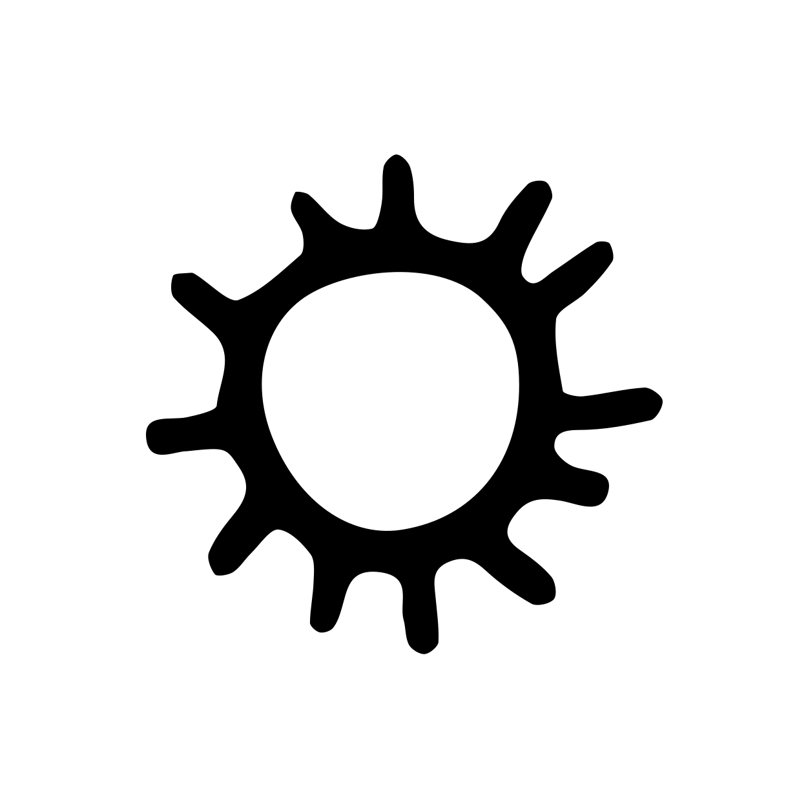

<h2> Blog</h2>

[](https://github.com/alchemmist/blog)
[](https://github.com/alchemmist/blog/actions/workflows/deploy.yaml)
 


[![Blog](https://img.shields.io/badge/alchemmist.xyz-red?style=flat&logo=data:image/png;base64,iVBORw0KGgoAAAANSUhEUgAAAB4AAAAeCAQAAACROWYpAAAAAmJLR0QA/4ePzL8AAAAHdElNRQfpCBkNDSaPhdvdAAACo0lEQVQ4y53VX2iVdRgH8I/nnE2nW6fNjnNMatgitiAUMc2ifzQqnJBgCCbtItdNdhF1IWiIVxFdSESQBBEYxRpdSBcGBbWIMmgKwSmtobOpHW3OrbENPTvn14Vnp/dsew/k97153ufh+zy/3/N83+clHo16tbhFPG5S77x0ddHXxAJKh3Ulq0G99khkiy+9WJ282zFd4Haky/47veMBM9UP+6RJI17zkM8EWfeV/G8KfrCyOjntlCCYUhAEv3pbr7eMm9UD7vVC5EQV2GlMKD3FshUEWRlJu/zuonsghad0+9hPWOolhzS66pRB5/yj1hqbPKwRQYfn7FFrv7NztV4VnLfHFh+5YcYRGytGUutRA4KCccGUQ5b+F2xyRFHehGDaK5KLXKbNt4Jg1PPz48sdNCMI3peKaeRmOcE30apzqHFUMGZT7BQSjgoGLF8okryTGHI6llw0iJVWLCSzBldMV1HAVaxyB6iTsWLuhsusR2oRuVYWanJQ1l3WajGc0m61jMdsQKvb/B1LbkbSThCMO5vytdXlDrbpNBBb936M+lTOhBHnDKf84YoLRrXqUm+H74RFyW0exG/2RftSLy2JBn2CXOyw3hAE097zhMzC8FbXBcdL/axEl1z5A5nVf1O+UT21SOFph73ucsS/xFaHNbvmmJy7dRiWr8zdKVvOPWCbRgkJaZu9a0xw3ctulmuaL9F6nwvO2+tDecG0n/Xpc8K1UsLLOuNm2G3WqO2o80HFCggmXVAQ9Feswwge8WNpydAtr2DQcZcEf9pmrQMmBSdtXIycjGylZxV9r1XSDjd8pQYJuwwJ+qMtnjMLJsq+jCW+cBGnTWmwTF7RJ37RI6uoKvYasQG0+8sZzf4HVllXWjVpJwzd+v/qGT1q4oL/ArGV39EThJYTAAAAJXRFWHRkYXRlOmNyZWF0ZQAyMDI1LTA4LTI1VDEzOjEzOjMyKzAwOjAw870+1wAAACV0RVh0ZGF0ZTptb2RpZnkAMjAyNS0wOC0yNVQxMzoxMzozMiswMDowMILghmsAAAAodEVYdGRhdGU6dGltZXN0YW1wADIwMjUtMDgtMjVUMTM6MTM6MzgrMDA6MDBxhfj6AAAAAElFTkSuQmCC&logoColor=violet&label=blog&labelColor=white&color=grey)](https://alchemmist.xyz?utm_source=github)

This repository contains the sources of my blog: [alchemmist.xyz](https://alchemmist.xyz?utm_source=github). On my blog I have this features:
<details>

<summary>Aesthetic minimalistic typography.</summary>


</details>

<details>

<summary>Search (<i>with <a href="https://pagefind.app/">pagefind</a>)</i>).</summary>


</details>

<details>

<summary>Comments (<i>with <a href="https://remark42.com/">remark42</a>)</i>).</summary>


</details>

<details>

<summary>Notifications about comments in Telegram.</summary>


</details>

<details>

<summary>Easter eggs (<i>try to find it</i>).</summary>


</details>

<details>

<summary>Share buttons.</summary>


</details>

<details>

<summary>Updates log.</summary>


</details>

<details>

<summary>Support of <a href="https://www.nerdfonts.com/cheat-sheet">NerdFonts icons</a>.</summary>


</details>

<details>

<summary>Easy to use icons with <a href="https://iconify.design/">iconify</a> and partials.</summary>


</details>

<details>

<summary>Multilanguages texts.</summary>


</details>

<details>

<summary>Totally custom design.</summary>


</details>

<details>

<summary>Hotkeys. See help with pressing ?.</summary>


</details>

<details>

<summary>Code syntax hilighting with GitHub light <a href="https://gohugo.io/quick-reference/syntax-highlighting-styles/#github">theme</a>.</summary>


</details>

<details>

<summary>Analytics platform of trafic (<i>with <a href="https://umami.is/">umami</a>)</i>)</summary>


</details>

<details>

<summary id="demo-alerts">Supporting markdown quotes as GitHub style callouts.</summary>


</details>

You are welcome to forking it for you personal blogs or contributing here. In this case it will be great if you put link to my blog `:)`. Or you can contribute here, report and fix bugs, sugest and implement new improvments. In order to do that, you need [Hugo](https://gohugo.io/) and [Pagefind](https://pagefind.app/), just for running locally:
```sh
make dev
```
After that on `localhost:1313` will up my blog.

If you want to up all infrostruture, please, use docker compose:
```sh
docker compose up -d
```
But befor it, you need to feel the gaps in compose.yaml with secrets, that you will use.


